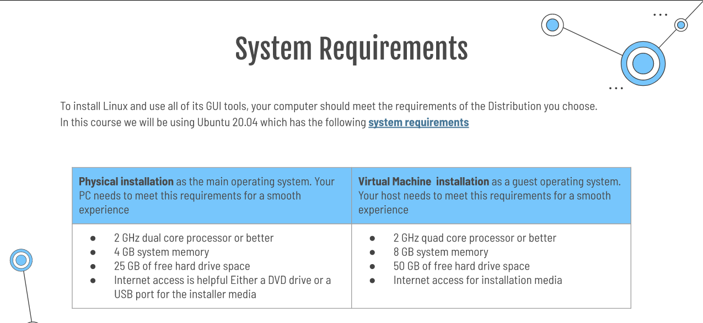

# Deliverable 1

## Introduction
*Computer is a set of hardware and software components. In this project, we will focus on software. Software is a collection of programs and procedures that tells the computer how to work. Linux is an example of operating system and is by far the most widely used. For this project, the computer most meet the following criteria. 

## Project hardware and software requirements

## What is Linux? 
Linux is an operating system. An operating system is the most important software that runs on a computer. It was released on September 17, 1991. For example, macOs is a proprietary operating system developed by Apple Inc. 

### Short history of Linux 
Linux is the most used open source operating system. Linux is a family of Unix operating system. 

### Linux Distribution
Linux distribution also knows as Linux distro. An operating system contains files that has been develop by other programmers. 

*  **Slackaware**
*  Slackware is a Linux distribution created in 1993.
  
*  **Debian**
* Ubuntu is a linux distribution on Debian and composed mostly of free and open source software. Ubuntu is released desktop, serve and core for Internet of things devices and robot. Ubuntu is a good way to start for beginners. 

> **Debian Based Linux Distributions**
>  Ubuntu: Ubuntu is a Linux distribution based on Debian and composed mostly of free and open source software. Ubuntu is released desktop, serve and core for Internet of things devices and robot. Ubuntu is a good way to star for beginners.  
>  Kali Linux is an open-source. 

* Red Hat Enterprise Linux
> Fedora: Fedora is not supported by Red Hat Products. 
        
## Open Source VS Closed Source
Open source software refers to the computer software which source is open means the general public can access and use. 

### Advantages of Open source
Open-source software to use, distribute and modified. It offers lower costs. Open Source is secure and the code is accessible to everyone. 

### Advantages of Closed source
This is a type of software application that does not allow the code to be modified. Unless the coder has authorization to modified or make changes to the code. 
One of the advantages of open source is user friendly, security, support and testing. 

## The Free software movement
Brian Fox the creator of Bash. Bash is a Unix shell and a command language interpreter,for the GNU operating system. Fox worked on this project for nine months: eight months to work on it and he deleted the project and put it back together in one month. Bash runs on nearly every version of Unix and other operating systems. Bash has become by far the most popular shell among users of Linux. For me the most fascinating aspect was that prior to this project, he worked in many other projects before working on Bash shell and successfully after nine months, he was ble to have this project done. From my coding experience form working on python, I had the code written but had an extra space. I could only run the code after deleting the space. In the same way, Brian Fox learned as she worked on this project and enhanced this code by learning what to do and what not to do. 

