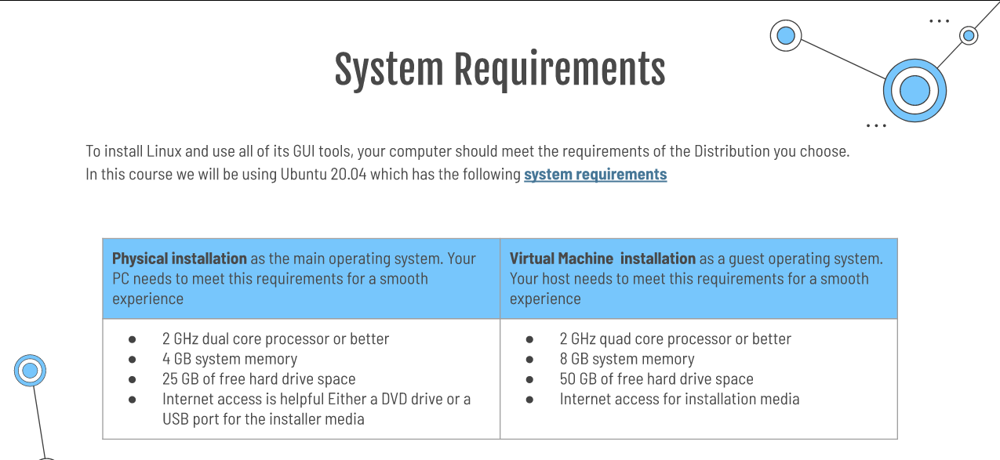

# Deliverable 2

## What is Virtualization?
Definition: Virtualization is a computer software program that will be behave as a computer. Having this type of computer inside the user's computer will allow the user to explore the computer and work on things such download documents, install any applications before doing it in their host machine. One of the benefits of virtualization is the use can run multiple Operating System on one machine. It allows applications to be tested before installing them on a host machine. 

## what is Virtualbox
Definition: Virtualbox is a virtualization software. It is a powerful type 2 virtualization which means, it runs on a host operating system such as oracle and Vmware Workstation Player/Pro. VirtualBox runs on Windows, Linux, Macintosh and Solaris. Virtualbox supports a large number of guests operating systems. 

## Installing Ubuntu in Virtualbox
The virtual box is divided in sections, such as: Name and operating system, Memory size, Hard disk, Hard disk file type, Storage on physicial hard disk, File location and size. 
1. The user must name its virtual machine. Main folder indicated where the virtual machine is located.  
2. Memory size: Ubuntu requires at least 2GB of Ram. 
3. Hard disk: This option allows the user to creater a virtual haed disk with any sized that the user will specify 
4. Hard disk file type: VDI(VirtualBox Disk Image)

### Types of virtualization 
Replication of hardware to stimulate a virtual machine inside a physical machine. Two general types of virtualization. 
* client side virtualization: 
  * It is software installed on a computer to manage virtual machine
  * Each virtual machine has its own operating system installed. 
* server side virtualization :
  * Server side provides virtual desktop to each user. 

Hypervisor: Hypervisor is software that creates and manages virtual machines(Vms). The hypervisor allows the computer to run multiple virtual computers using the same sources as the host computer. ATM machines uses hypervisors. 

## Types of Hypervisors 
1. Type 1: Type 1 are commonly called Bare metal or native if anything runs natively in your computer. 

2. Type 2: Type 2 are the one that we know as regular virtual machines 

### Virtual Manager 
Virtual manager support different types of virtualization such as Qemu, Zen and Xen used in Linux and windows. 

### Installing Endeavour OS in Virtual Manager 
The first step to install Endeavour, installing all packages to run virtual-manger. Second, it is important to enable livirtd service, Third, check for the status to see if it downloading properly. 
Fourth, it is important to re-star the computer. Fifth, after Download has been completed, star the installation as regularly you do in a virtual machine. 