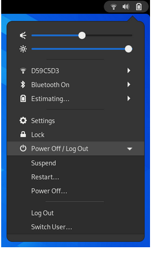
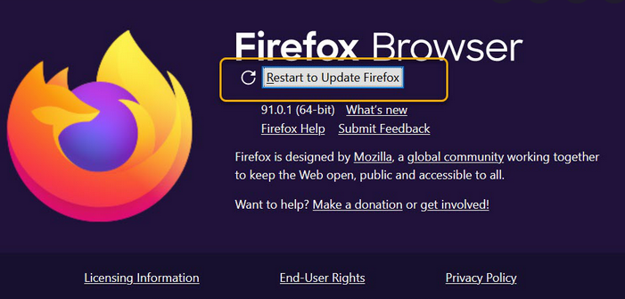
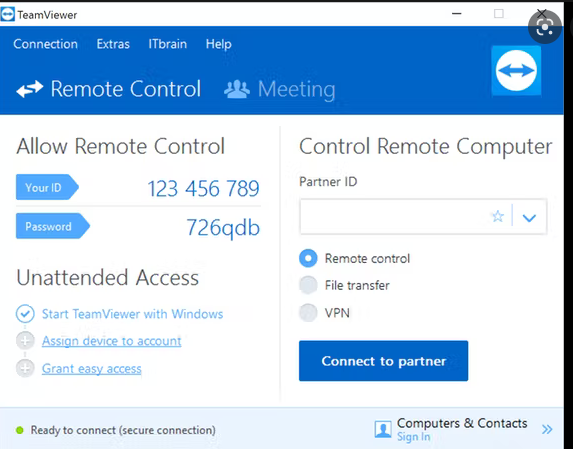
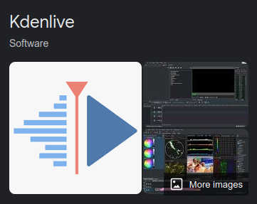
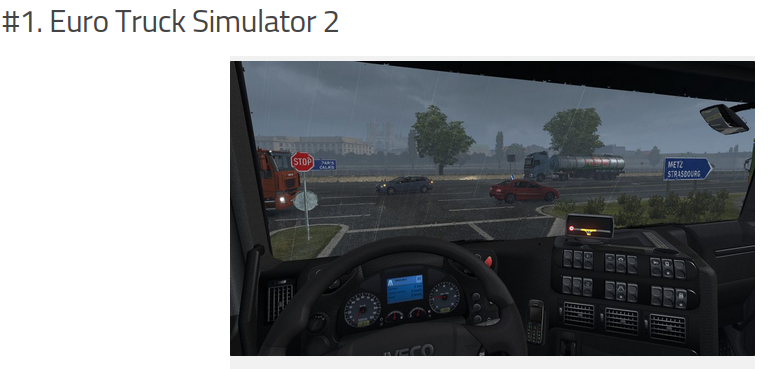
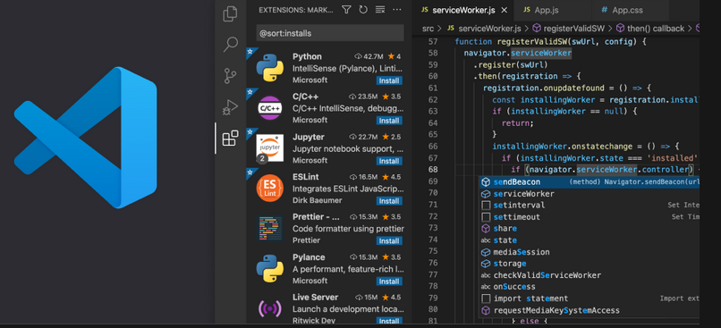

# Deliverable 3

### Connecting Ubuntu to the internet

1. First, open the system menu from the right side of the top bar.
2. Second, select Wi-Fi Not Connected. The Wi-Fi section of the menu will expand.
3. Third, Click on select Network.
4. Fourth, select the network you want and next click Connect. 
   a. If you can not find your network, it means that it might be hidden or is not available. 
   1. If the network is protected by a password, please provide the password of the internet and click connect.
   2. If the user doe not know the password, the user needs to look the wireless router or base station. 
5. If the connection is successful, the icon will change to a dot with several curved bars. The more bars indicate a stronger connection to the network and fewer bars mean the connection is weaker. 

Example: 
 !

## Every day tasks In Ubuntu
Ubuntu is secure fast and open source. In ubuntu is possible for the user to have access to Browser and Email clients. In messaging the user can download the messaging applications such as: skype, viber and cawbir. If the user needs work on an image editor, the user will has access to GIMP which is a free image edition and a powerful alternative to adobe photoshop. KDENLIVE is an available video editor application in Ubuntu and for audio editor the user can access to Audacity. 

### Internet browsing & Internet email
The user of Ubuntu will have access to Firefox, Chrome and Thunderbird. These internet browser will allow the user to read and send e-mails. 

1. Firefox: This is an internet browser that does not sell the users personal data to advertisers. 
2. The user can download Firefox by going to the terminal and install firefox. We do this by using the following command:
3. Command: 
                  sudo apt install firefox
 !

### Reading email
In Ubuntu the users can download the following internet browsers or applications: Firefox, Chrome, Thunderbird, Edge and Geary Email Client.

! 

### Remote assistance
Remote assistance is a computer application that allows a user to remotely control another computer. Example of remote assistance: 
1. Teamviewer
2. KDE connect 
3. VNC connect 
4. Vinagre
   
 !   

### Office productivity (writing documents, editing spreadsheets and doing presentations)
Office productivity writing documents, editing spreadsheets and working on presentation is possible in lInux. 
1. LibreOffice is the most popular alternative to Microsoft Office.
2. WPS Office. WPS Office is a simple but fast office suit. 
3. GNOME Office.
4. Calligra Suite.
5. Google's G Suite/Google Drive.
6. Feng Office.

 !   

### Streaming music and video
When it comes to video editor. Ubuntu provides KDENLIVE, it is one of the best open source video editor software on LInux.
 ! 

### Video games
Linux is an open-source operating system therefore, it gives the users enough options when it comes to games. If the user is new to this operating system, it is best to get familiar at first. It my opinion Euro truck stimulation 2 is one of the best games and very close to a reality when driving trucks.   
! 

### Video Chatting/calling/conferencing
Skype, Zoom, Viber, Slack and Cawbir. Zoom is an online audio and web platfrom.It allows the users to connect around the world and conduct meeting online. Zoom was founded in 2011 by Eric Yuan. In 2019 zoom had 75 million users and during the pandemic it went up to 175 million users around the world. 
!

!

### Texting/Instant messaging
Skype, Viber, Slack and Cawbir. 
! 

### Programing
Visual studio code is a code editor for development operations like debugging, task running, and versition control. The user will install just by downloading the program. 
! 

### Educational Applications (dictionaries and that kind of stuff)

### How to get help with your Ubuntu machine

## Sources
1. https://www.google.com/search?q=euro+truck+simulator&client=ubuntu&channel=fs&tbm=isch&source=iu&ictx=1&vet=1&fir=Sf1iaI7osXUVCM%252Cas79VE6bGaTBpM%252C%252Fm%252F0zrpxf0%253BUHCuQAQ--KADrM%252CX5Lpv5qkTltj0M%252C_%253BZv5dxWqtr7f_IM%252CySC_Qp56-P0R5M%252C_%253BqgGimF1OfVEphM%252CX5Lpv5qkTltj0M%252C_%253BFgNxmRoUszrPtM%252C0HxgG_U79xizRM%252C_%253B4SG4YCSW8YyNWM%252CPWLVfB5RBTzycM%252C_%253BcDvEvPFgtPLwFM%252ClT9Jb3N7pRMLOM%252C_&usg=AI4_-kTyQiCZ3b2qwDOTLcEsNmWrEuDoow&sa=X&ved=2ahUKEwjIhPzC6-H3AhWujIkEHdSnBUQQ_B16BAhLEAE#imgrc=Sf1iaI7osXUVCM
2. 