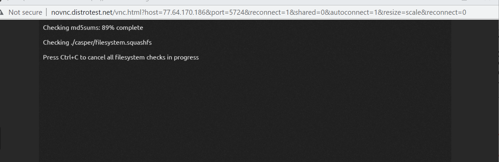
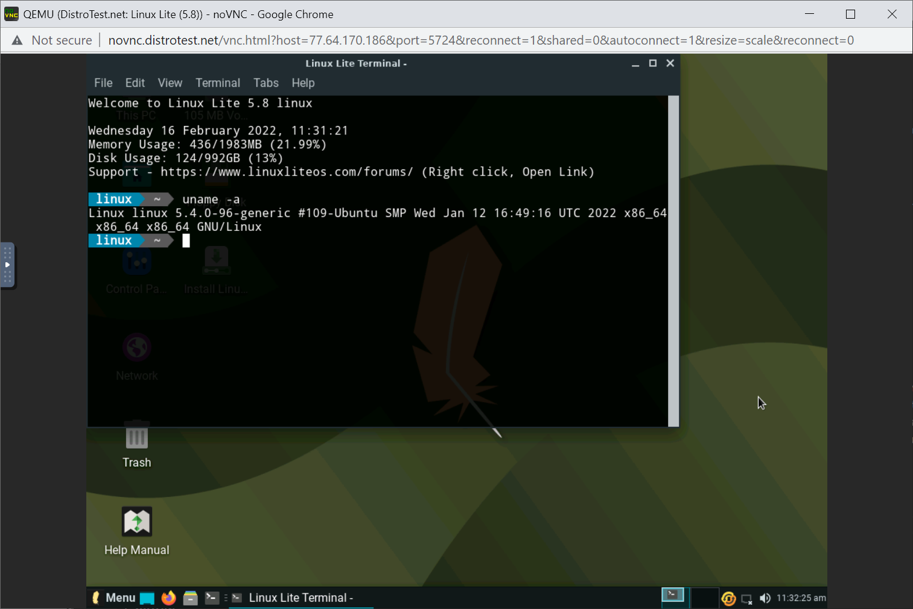
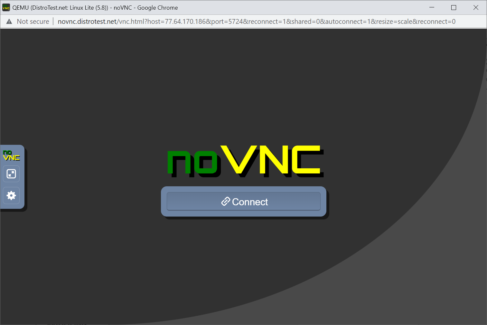

# Lab 1 Exploring Linux Distribution

## Question 1

1. What is the OS Type: **Linux**
2. Which major distro is it based on? **Debian**
3. Which processor architecture does it support? **armhf, ppc64el, riscv, s390x, x86_64**
4. Is the distribution active or is it discontinued? **Active**
5. What is the distro’s home page? **https://www.ubuntu.com/**

## Question 2

1. What is the name of the distribution and the OS Type: **Linux**
2. Which major distro is it based on? **Debian, Ubuntu (LTS)**
3. Which processor architecture does it support? **i386, x86_64**
4. Is the distribution active or is it discontinued? **Active**
5. What is the distro’s home page? **https://rescuezilla.com/**

## Question 3

1. What is the name of the distribution? **Linux**
2. What is the country of Origin? **Greece**
3. What major distribution is it based on? **Debian (Stable), antiX**
4. What is the distribution category? **Desktop, From RAM, Live Medium, Raspberry Pi**
5. Which processor architecture, aside from the one in the original query, does the OS support? **armhf, i686, x86_64**

## Question 4
### A Linux distribution used for Data Rescue/Data recovery

| Distro Name       | Website                           |Desktop Environment |
|-------------------|-----------------------------------|--------------------|
|**Rescuezilla**    | ** https://rescuexilla.com/**     | **LXDE**           |

### A Linux distribution used for Education that supports the ix86 processor architecture.

| Distro Name       | Website                            |Desktop Environment |
|-------------------|------------------------------------|--------------------|
|**NixOS**          | **http://nixos.org/**              | **Awesome, Enlightenment, Fluxbox, GNOME, i3, IceWM, KDE Plasma, Ratpoison, Xfce** |

### A Linux distribution that supports the OEM installation method

| Distro Name       | Website                            |Desktop Environment      |
|-------------------|------------------------------------|-------------------------|
| Linux Mint        |**https://linuxmint.com/**          |**Cinnamon, MATE, Xfce** |

## Question 5

** There are requirements for the Linux distribution to be approved. The developer must have the name of their project or distribution, the URL of the project’s website, a brief description of the distribution and the goal of it and the link to the distribution (ISO file). There are some projects that are waiting to be evaluated such as Movian and AlterLinux; their project was submitted on 2020.**  

## Question 6

