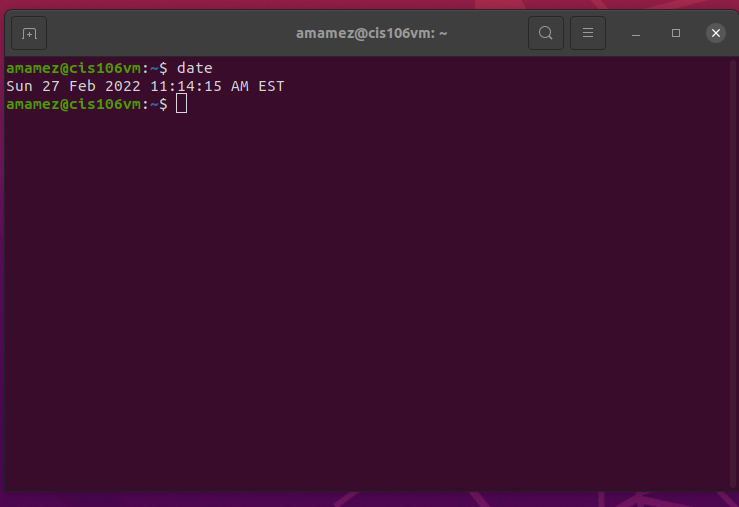
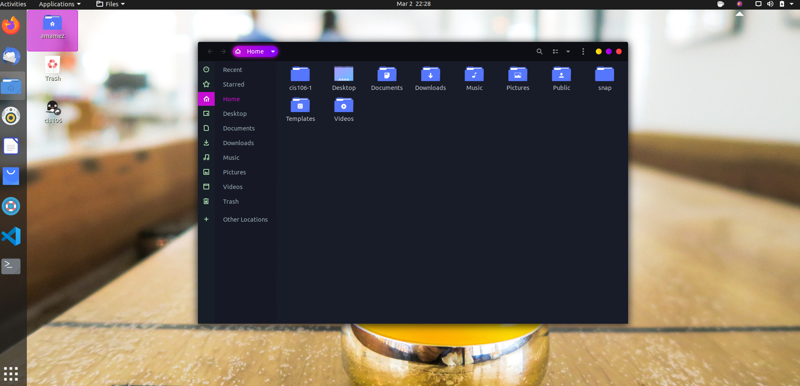
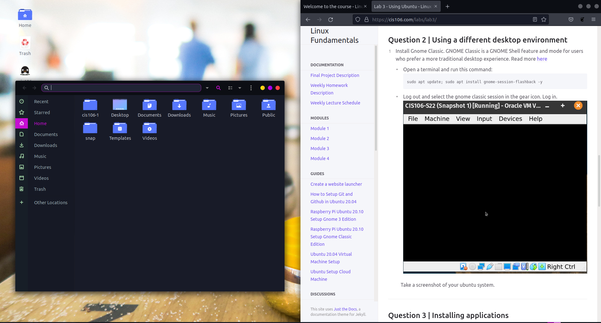

# Lab 3 Using Ubuntu 

# Question 1 

# Question 2 

# Question 3 

| Program purpose     | Package Name     | Version            | Description                                             |
| ------------------- | ---------------- | ------------------ | ------------------------------------------------------- |
| Play a tetris game  | quadrapassel     | 1:3.36.0-1         | popular Russian game, similar to Tetris                 |
| Play a video file   | dragonplayer     | 4:19.12.3-0ubuntu1 | simple video player                                     |
| Browse the internet | epiphany-browser | 3.36.4-0ubuntu1    | Intuitive GNOME web browser                             |
| Read your email     | geary            | 3.36.1-1 amd6      | lightweight email client designed for the GNOME desktop |
| Play music          | gmpc             | 11.8.16-17 amd64   | GNOME Music Player Client (graphical interface to MPD)  |

Commands Answers: 
* Sub question 1: sudo apt install quadrapassel dragonplayer epiphany-browser geary gmpc -y
* Sub question 2: sudo apt remove quadrapassel dragonplayer epiphany-browser geary gmpc -y
* Sub question 3: sudo apt purge quadrapassel+ dragonplayer+ geary-

# Question 4
  
| command | what it does                                        |
| ------- | --------------------------------------------------- |
| echo    | display a line of text                              |
| fortune | print a random, hopefully interesting, adage        |
| cowsay  | configurable speaking/thinking cow (and a bit more) |
| lolcat  | rainbow coloring for text                           |
| figlet  | no manual entry                                     |
| toilet  | display large colourful characters                  |
| rig     | Random Identity Generator                           | 

