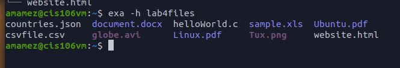

# Lab 4

## Question 1: The linux filesystem 
  
| Directory | Function                                                                                                                                       |
| --------- | ---------------------------------------------------------------------------------------------------------------------------------------------- |
| bin       | Essential commands                                                                                                                             |
| dev       | Device files                                                                                                                                   |
| etc       | System configuration files                                                                                                                     |
| home      | User home directories                                                                                                                          |
| media     | Mount point for removable media, such as DVDs and floppy disks.                                                                                |
| opt       | Add-on software packages                                                                                                                       |
| proc      | Kernel information, process control, system hardware information                                                                               |
| srv       | Information relating to services that run on the system                                                                                        |
| usr       | Software not essential for system operation, such as applications                                                                              |
| var       | Dedicated to variable data, such as logs, databases, websites, and temporary spool (e-mail etc.) files that persist from one boot to the next. |
   

| Command | What is does                                                | Syntax                           | Example          |
| ------- | ----------------------------------------------------------- | -------------------------------- | ---------------- |
| **cd**  | used for changing the current working directory.            | **cd +  destination**            | cd Downdload     |
| **pwd** | used for displaying the current working directory.          | **pwd**                          | pwd              |
| **ls**  | used for displaying all the files inside a given directory. | **ls -option files/directories** | ls -a ~/Pictures |

## Question 2: The linux filesystem 
 
 

## Question 3
 
 

## Question 4 
 
 
 
 
 

## Question 5

 
 
 
 
 