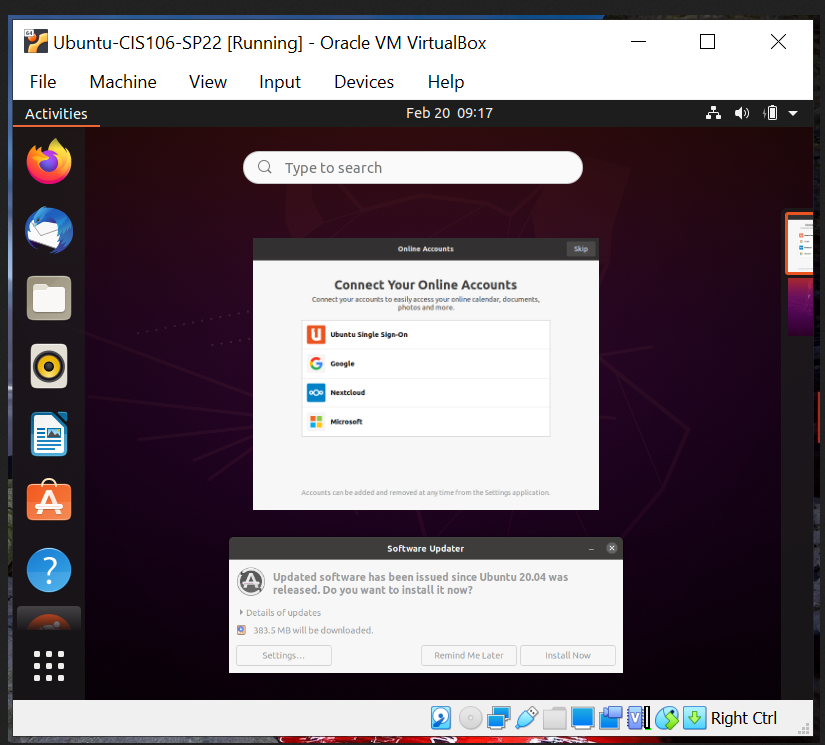

# Week Report 2
## Summary of Presentations: Virtualization 
1. What is virtualization?
  
* It is the imitation of all or part of a computer or network. 
* The purpose if a virtual machine is to run a virtual PC within a physical PC.  
* Virtualization can be used for learning purposes such as learning, testing, or running an application. 
* Virtualization: In the case of a single computer, virtualization can imitate the hardware, Os(Operating system)  and applications.   
*Hardware: It includes the physical parts of a computer, CPU central processing unit, monitor, keyboard, graphic cards, speaker.  
*OS Operating system: Software that controls a computer.  

## Types of virtualization
  
Types of virtualizations: 
There are two types of virtualizations: Server side virtualization and Client side virtualization.  

* Serve side virtualization:  It is the process of diving physical server into multiple virtual servers. Each virtual server can run its own operating system.  
  
* Client-side virtualization: In a business environment, companies must manage technological resources by cutting costs and allocating resources wisely.
Client virtualization is a popular method by providing applications, file sharing service and other tools. 

## Virtualbox Screenshots 

## what is a Rasberry pi? 
1. A bulleted list of different models
   Raspebrry Pi is a computer, they are great for building your own prototype of robots,security camera, music, games and others. 
   * Rasberry Pi B+
   * Rasberry Pi 2B
   * Rasberry Pi 3B
   * Rasberry Pi 3B+
  
2. Specs of the latest model (Raspberry pi 4 or 400) you can use a screenshot.
One of the latest models in the family of Raspberry Pi computers is the Raspberry Pi 400. 
  
3. Bulleted listed of 5 projects you can do with a raspberry pi. Use the internet to find this information.
* control your lights at home 
* Play games 
* a new operating system 
* learn linux commands 
* Install Nextcloud

 

 