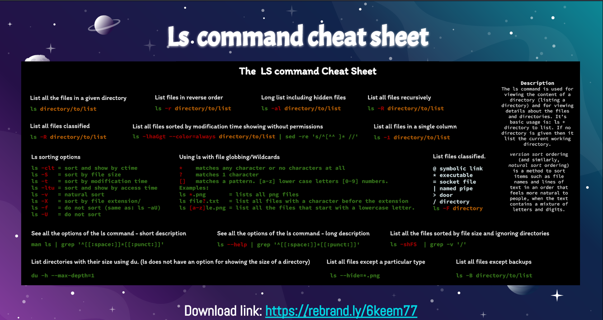

# Week Report 4
## Summary of Presentations: Navigating the Filesystem

A. Summary of the Presentation. 
  
* File system: The way files are stored and organized to simplify access to data. 
* The first directoy in the file system is called the root directory. The root directory contains all the files and subdirectories that makes your computer.
* You are always working inside a particular directory and the user can move forward to a subdirectory or backward to the previous directory- called a parent directory.
* The directory that a user is using at the present moment is called the current working directory or present working directory.
* Every files has a pathname, which indicates the location of the file in the filesystem. 
* There are two types of Pathnames: Absolute Path and Relative Path. 
* Absolute path:  It is the full pathname starting from root. 
* Relative path:  the pathname from directory inside your present working directory. 
* Pwd: Used for displaying the current working directory
* Cd: changes the present working directory 
* ls: list all files and directories in a given directory. 
* Tree: List all files and directories in a given directory in a nice tree like format. 
* Cd Command: cd + destination 
    1. If you want to go to your home directory: cd, cd~, cd $HOME
    2. If you want to go to your previous current working directory: cd -
   

  
B.  Definition of the  following terms: 
  
  1. File System: The way files are stored and organized to simplify access to data. 
  2. Current directory: The directory is where you are now. 
  3. Parent directory: You are always working inside a particular directory, and you can move forward to a subdirectory or backwards to the previous directory.
  4. The difference between your home directory and the home directory: 
  5. Pathname: It indicates the location of the file in the filesystem. 
  6. Relative Path: The partial pathname staring from a directory inside your present working directory. 
  7. Absolute Path: The full pathname staring from root. 

c. What is the right to repair movement and why does it matter? 
As a student, the right repair movement promotes the student to save money and fix items on their own.
Unfortunately, some devices are expensive and so complex in their designed that is better for consumers to take these devices to the manufacturer to avoid ruining them.

