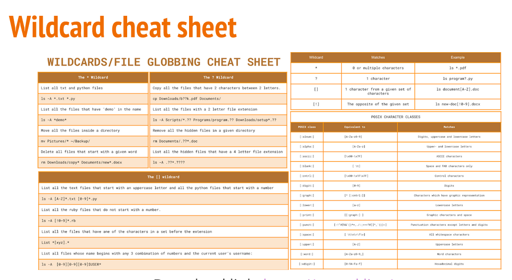

# Week Report 5
## Commands, definition, usage and example

### Mkdir: 
* Definition: It is used to creating a single directory or multiple directories.   
* Usage: mkdir + the name of the directory
* Examples: 
  * Create a folder in the present working directory 
    * mkdir wallpapers/
  * Create multiple directories
    * mkdir wallpapers/cars wallpapers/cities wallpapers/forest
  * create a directory with a parent directory at the same time
  
### Touch:  
* Definition: It is a command for creating files.    
* Usage: Touch +file
* Examples: 
  * To create a file called list: 
    * Touch list 
  * To create several files:
    * Touch names.csv script.py
  * To create a file using absolute path: 
    * Touch ~/Downloads/games.txt
  
### Rm:
* Definition: It is a command that allows the user to remove files. 
* Usage: rm +file
* Example: 
  * To remove a file 
    * rm list 
  * Remove a file and prompt confirmation before removal 
    * rm -i list 
  * Remove an empty directory
    * rmdir Downloads/games
  
### Rmdir:
* Definition: This command allows to remove an empty directory.
* Usage: rmdir + directory
* Example: 
  * rmdir Downloads/games
  
### Mv: 
* Definition: This command moves and renames directories.  
* Usage: mv + source + destination 
* Example: 
  * For renaming files/directories: 
    * mv + file/directory
  * To move a file from a directory to another using relative path
    * mv Downloads/homework.pdf Documents/
  * To move a directory from one directory to another using absolute path
    * sudo mv ~Downloads/theme /usr/share/themes

### Cp: 
* Definition: Cp command that copies files/directories from a source to a destination.  
  * Usage: cp + files to copy + destination 
* To copy directories you must use the -r option
  * Usage: cp -r + directory to copy + destination
* To copy a file 
  * cp Downloads/wallpapers.zip pictures/
* To copy multiples files in a single command
  * sudo cp -r script.sh program.py home.html assets/ /var/www/html/

### Ln: 
* Definition: It is a command  to create a hard link. A hard link is a file that point to data on the hard drive. 
  * To create a hard link: ln file ~/Downloads/fileHL
  * To create a symbolic link: ln -s file fileSL
  

### Man: 
* Definition: Man is command used to look for quick references.   

Brace expansion and how to use it: 

Brace expansion {} is not a wildcard but another feature of bash that allows you to generate arbitrary strings to use with commands.  
   
!
  

