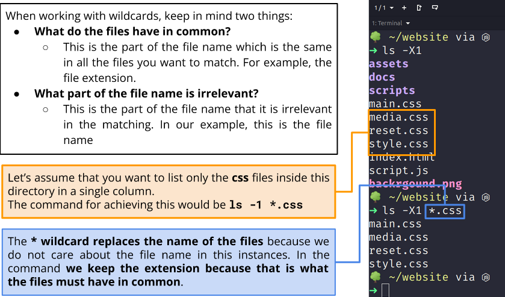

# Week Report 6
## Summary on Wildcards 

A. Summary of the Presentation. 
* Wildcards: 
  * Definition: Wildcards represent letter and characters use to specify a file name for searches.
  * Wildcards are also know as metacharacter wildcards. 
    * You can use a wildcard to get a long list of all files in the current directory starting with new. 
    * Use wildcards to manage to directories faster
    * Move or delete a group of files
    * Locate files on a portion of their filenames 
    * create files and directories quicker
  
  * Wildcard is a star (*) character.
      * Example: ls *.txt
        * This will match all files edn in .txt 
  
 * Benefits of using Wildcard: 
    * when you want to list all files with a particular file extension 
    * when you remember a portion of the name 
    * when you want to copy, move or move all files that match a particular naming convention
    * Example: 
   !
   !

* Formula: List only the CSS files
   !

* List files inside a single column.
    * First: ls -X1 
    * Second: ls -X1 *.css
  
* The Wildcard (*) replaces the name of the files because we do not care about the file name in this instances. 
  
* The Wildcard:
  * The brackets wildcard match a single character in a range.
  * The brackets wildcard use the exclamation mark to reverse the match. 
    * Example: match everything except vowels [!aeiou]
    * Example: any character except numbers [!0-9]
    * Examples: 
      * 1. To match all files that you have a vowel after letter f: 
        * Example: ls f[aeiou]*
      * 2. To match all files that do not have a vowel after letter f: 
        * Example: ls f[!aeiou]*
      * 3. To match all the files whose name does nto have a number in their file name: 
        * Example: ls *[!0-9].*
      * 4. to match all files whose name begins with a letter form a-p or start with letter s or c:
        * ls[a-psc]*

* Whilecard Rule:
  * !
  * !

* Using Brace Expansion
  * Brace expansion {} is not a wildcard
    * To create a whole directory structure in a single command: 
      * mkdir -p music/{jazz,rock}/ {mpfiles, videos, offiles}/new{1..3}
    * 
  * To create a N number of files use: 
      * touch website {1..5}.html
      * touch file{A..Z}.html
  
  * to remove multiple files in a single directory
    * rm -r{dir1,dir2,dir3,file.txt,file.py}